# Sistema solar

## ☀️ Sol
- Se mueve por la una línea que representa el plano del Sistema Solar llamado **eclíptica**.
- Debido a la **inclinación del eje** de la rotación de la tierra cambia la posición de la eclíptica dando lugar a las **estaciones**.
- Los puntos de inflexión son el día más largo, la noche más larga (**solsticios**) y las noches iguales (**equinocios**).
- El cambio en la posición del *Sol* por el eje de rotación la excentricidad de la órbita se ve en la **ecuación del tiempo** y en el **analema**.
- Tiene el **99%** de la **masa** del Sistema Solar.

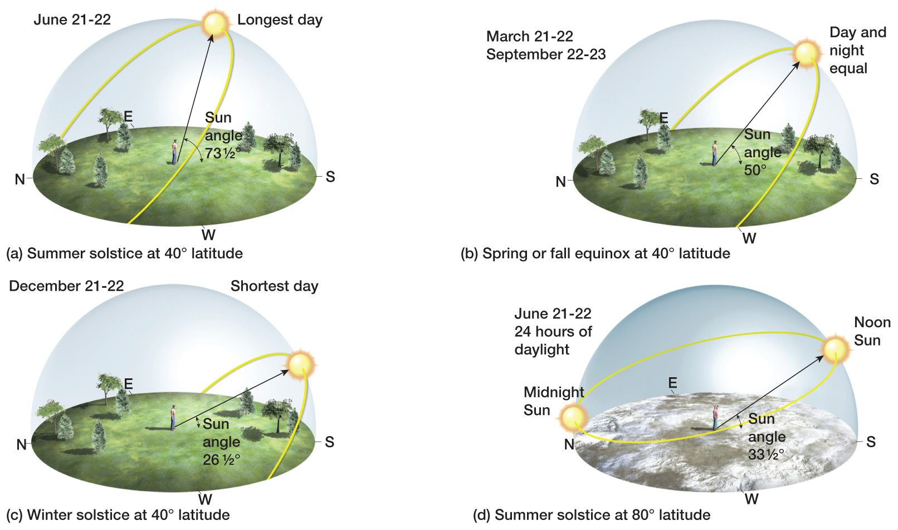
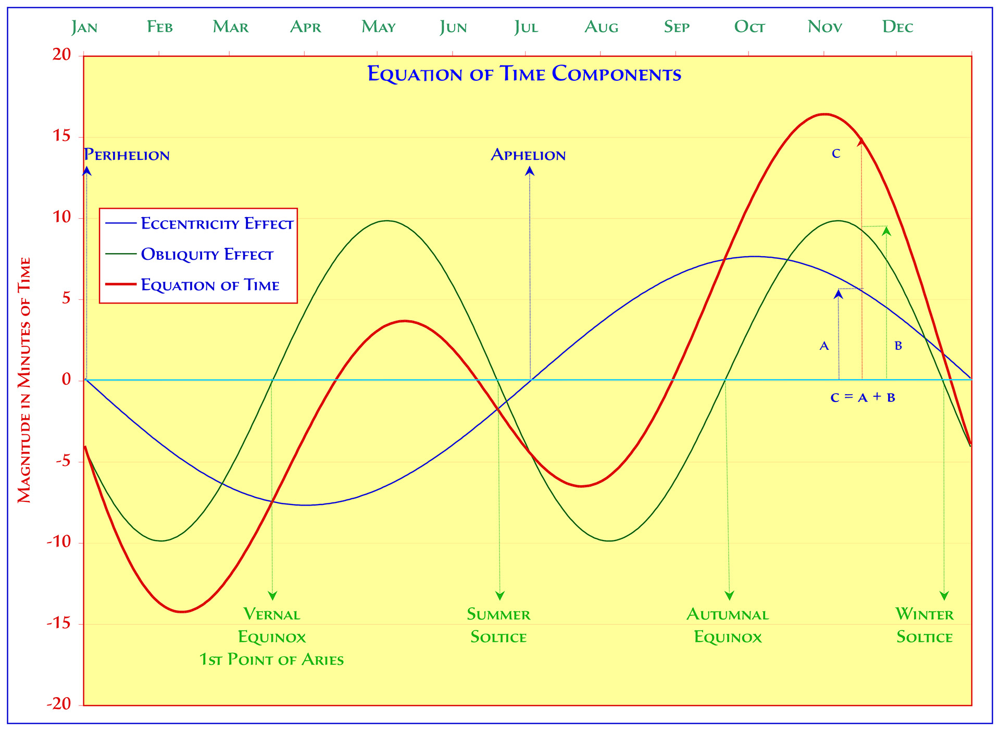
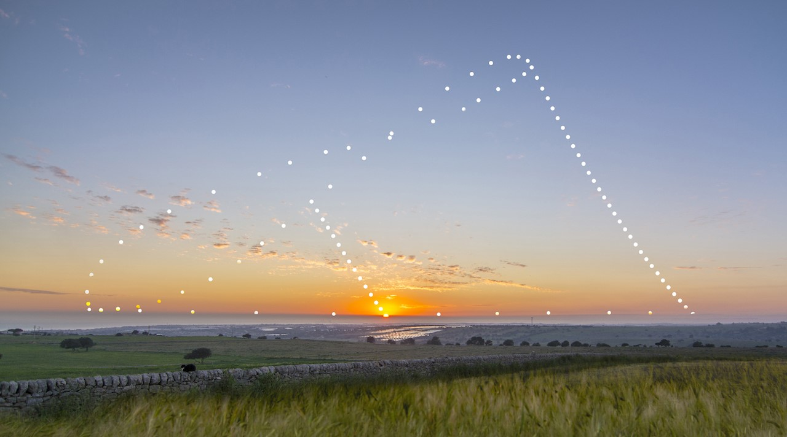

## 🌕 Luna
- Luna > Fases > Salida y puesta de luna.
- La tierra es **4 x luna** está a **30 x tierras** de distancia y pesa **80 x lunas**.

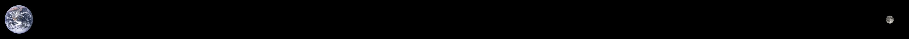

- **No** tiene **atmósfera** ni placas **tectónicas** porque su centro no está suficientemente caliente para fundir y mover la roca de la corteza.
- Los **mares** son lava solidificada desde su formación y las **cráteres** impactos de metroritos.

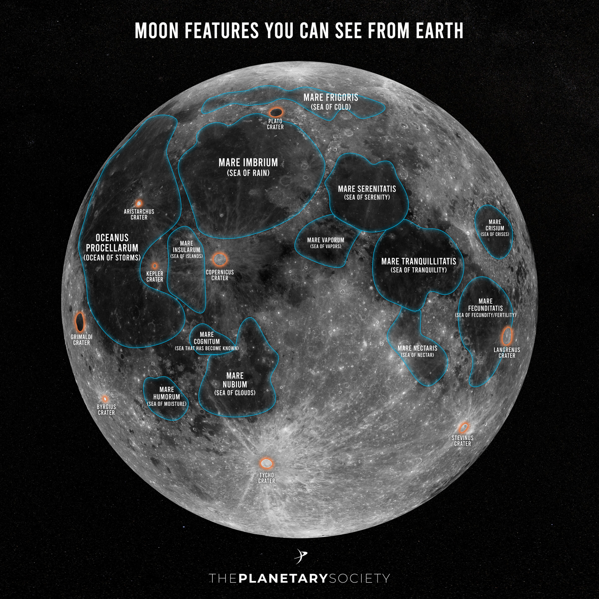

## 🛰️ Satélites
- Órbitas > Geoestacionaria (alta) (meteo y comms) (36000km) > Polar (media) (navegación) > LEO (baja) (comms y observación terrestre) > Lagrange
- ISS (Estación Espacial Internacional) LEO, 2h, 2000km, 8km/s
- StarLink (en línea al lanzamiento)

## 🪐 Planetas
Se mueven cerca de la *eclíptica*. Rotan y orbitan el Sol en sentido antihorario respecto al polo norte.
### Mercurio
- (1 Tierra = 2 x Mercurios)
- Su día dura más que su año.
- Se pueden ver dos amaneceres en el mismo día por el movimiento retrógrado del Sol.
### Venus
- Sólo se ve al amanecer o al atardecer de ahí los nombres: **Lucero matutino / vespertino**.
- Podemos ver sus **fases**, como la Luna.
- Su atmósfera provoca un efecto invernadero infernal y **llueve ácido sulfúrico**.
- Su día (**250 días terrestres**) dura más que su año y rota al revés que el resto de planetas.

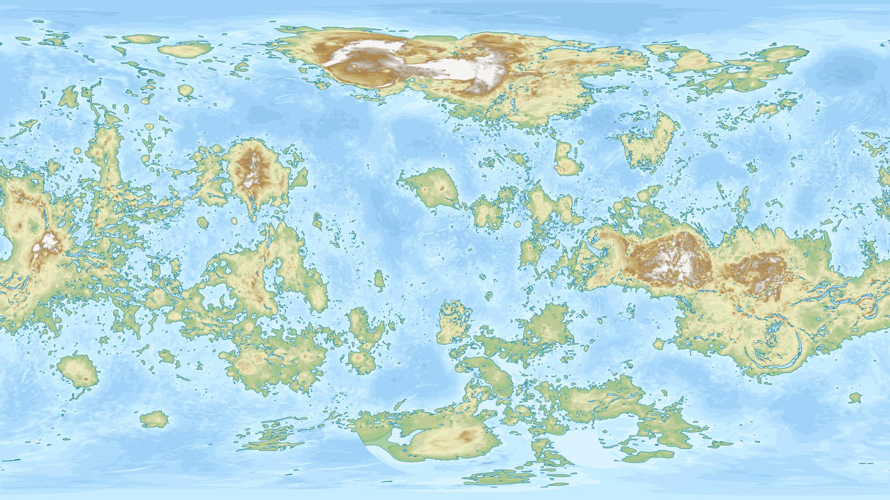

### La Tierra
- Tiene la **luna** más **grande** del *Sistema Solar* proporcionalmente (1 Tierra = 4 x Lunas)
### Marte
- (1 Tierra = 2 x Martes)
- Tiene la **montaña** más **alta** del *Sistema Solar* 2.5 veces más alta que el *Everest*.
- Tiene el **cañón** más **largo**, ancho y **profundo** del *Sistema Solar* 10 veces el Cañón del Colorado (ocuparía todo EEUU).
- Las zonas **bajas** tiene zonas **altas** en sus **antípodas** (Hellas / Alba), (Tharsis / Utopia), (Argyre / Elysium).

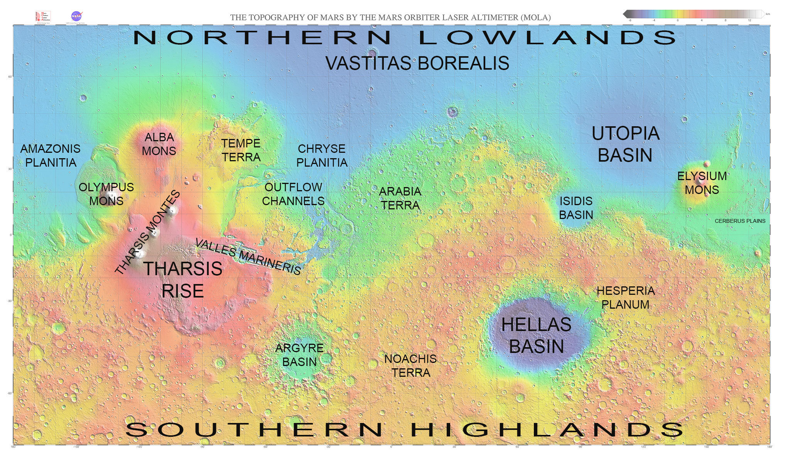

### Júpiter
- (1 Júpiter = 11 x Tierras)
- Las 4 lunas galileanas se pueden ver con prismáticos y tienen las orbitas sincrozadas a razón de 1:2:4:10.
- **67 lunas** en total, una es más grande que *Mercurio*.
- Gira muy rápido provocando muchos huracanes.
### Saturno
- (1 Saturno = 9 x Tierras)
- Poco denso, **flotaría** en el agua.
- Su anillos tienen 100 metros de grosor.
### Urano
- (1 Urano = 4 x Tierras)
- Su descubridor lo llamó **Jorge**.
- Su **eje** de rotación con casi **90º** respecto a su órbita.
### Neptuno
- (1 Neptuno = 4 x Tierras)
- Se **predijo** su existencia antes de ser observado.
- Llueven **diamantes**.
- Su luna más grande gira al revés, tiene un órbita muy inclinada, criovolcanes activos y es más grande que *Plutón*.
### Planeta 9
- *Plutón* fue un planeta, pero era muy pequeño (1 Tierra = 5 x Plutones) y con una órbita fuera del plano del resto.
- Puede que exista otro planeta pero no se ha confirmado.

# Espacio profundo
- El **catálogo Messier** tiene los objetos más fáciles de observar en el hemisferio norte.
- A partir de 2 millones de años luz empezamos a ver otras *galaxias*. Entre *Virgo* y *Leo* podemos ver un *cúmulo* de **galaxias**.
- **Maratón Messier** para ver lo 110 objetos del catálogo en una sola noche. 

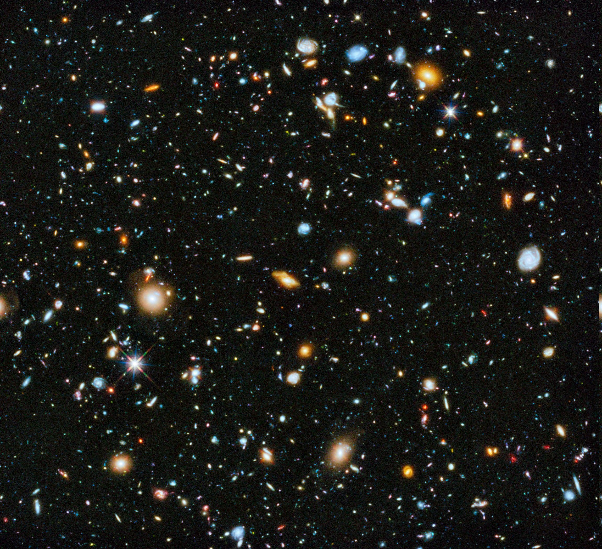

## 💫 Vía Láctea
- En el brazo de la **Vía Láctea** donde está el *Sistema Solar* hay muchos *cúmulos abiertos* y *nebulosas* a menos 10000 años luz.
- Hacia el centro de la **Vía Láctea** y en otros brazos a partir de 6000 años luz vemos *cúmulos globulares*.

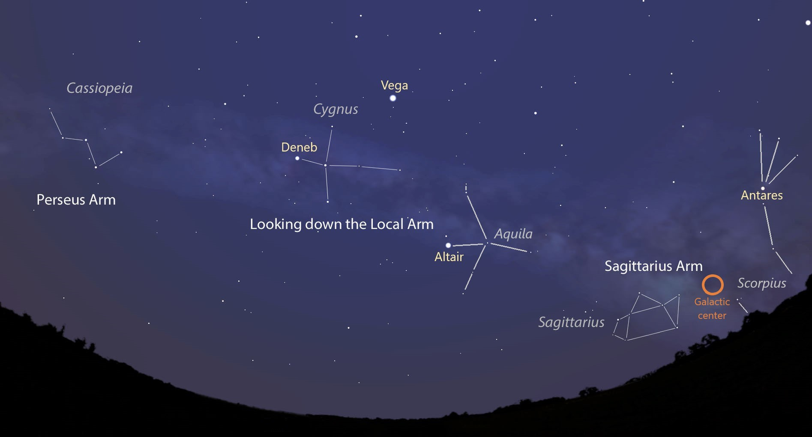

- En el centro de la **Vía Láctea** hay un agujero negro supermaviso llamado *Sagitario A**.

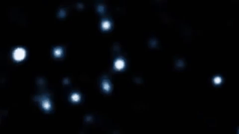

## ✨ Constelaciones
- 88 en total, 48 clásicas de *Ptolomeo*, 12 del *Zodiaco*.
- Las 12 del *Zodiaco* cerca de la *eclíptica*.
- La designación de *Bayer* asigna una letra griega por orden de luminosidad a cada estrella de la constelación.
- Las cercanas al norte están visibles todo el año.
- Las cercanas al horizonte se ven en los dos hemisferios.
- Osa Mayor > Estrella Polar > Osa menor > Casiopea > Hora sideral
- Las constelaciones del hemisferio sur se nombraron en la era moderna: *octante*, *sextante*, *brújula*, *reloj*, *telescopio*, *microscopio*, *máquina neumática*, *barco*, *velas*, *quilla*...

## ⭐ Estrellas
- La mayoría de las estrellas más luminosas son **binarias** y están en la **Vía Láctea**.
- **Sirio** es la más luminosa, nariz de *Canis Maior*, le apunta el cinturón de *Orión*.
- **Alfa Centauri** es el sistemas solar más cercano a 4 años luz.
- **Betelgeuse** en el cinturón de *Orión*, es **764** veces más **grande** que el Sol.
- **Vega** fue la estrella polar al inicio de la civilización (12000 a.C.) con magnitud 0 y parte del *triángulo estival* con **Altair** y **Deneb** (que reposan en vía *Vía Láctea*).
- *M45* **Pléyades** (7 estrellas cercanas en el culo de *Tauro*).
- **M13** Cúmulo globular (en el sobaco de *Hércules*).
- **M3** Cúmulo globular (a la derecha de *Bootes*).

## 🌌 Galaxias
- *M31* **Andrómeda** (apunta una punta de *Casiopea*) tiene galaxias satélites. Nos chocamos y fusionamos con ella dentro de 6000 millones de años.
- *M51* **Remolino** (justo debajo del asa del cazo de la *Osa Mayor*).
- *M33* **Triángulo** (entre el *Triángulo* y *Andrómeda*).
- *M87* Chorro de plasma parte de un cúmulo de galaxias donde se hizo la primera foto de un agujero negro (en la mano de *Virgo*).

- *NGC 5139* Cúmulo *Omega Centauri* (en el lomo del *Centaruro*).
- *M104* **Sombrero** (entre *Virgo* y *Corvus*).

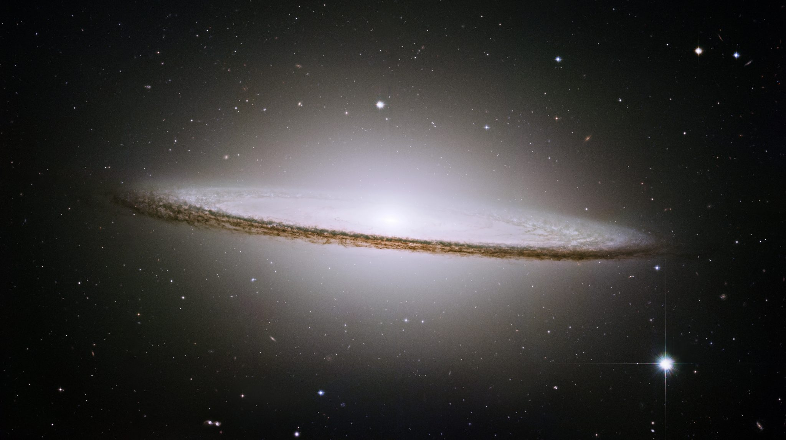

## ☁️ Nebulosas
### Formación estelar
- *M42* Nebulosa de **Orión** (debajo del cinturón). Parte del complejo de nebulosas de absorción como el *caballo*, la *bruja* o la supernova *bucle de Barnard*.

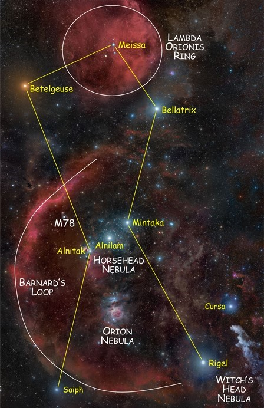

- *M8* Nebulosa del **Lago** (encima del brazo de *Sagitario*).
- *M16* **Pilares de la Creación** o Nebulosa del *Águila*.

- Nebulosas del **Corazón** y el **Alma** (debajo de *Casiopea*).

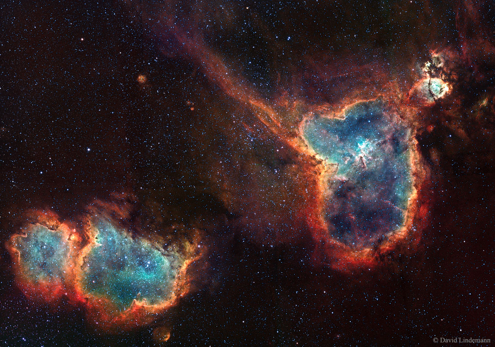

### Planetarias
Son **gases** expulsados por la **enana blanca** apagándose en el centro.
- *M27* Nebulosa **Dumbbell** (entre *Vulpecula* y *Sagitta*, en medio del triángulo de verano).
- *M57* Nebulosa del **Anillo** (en la sujección de las cuerdas de *Lira*).

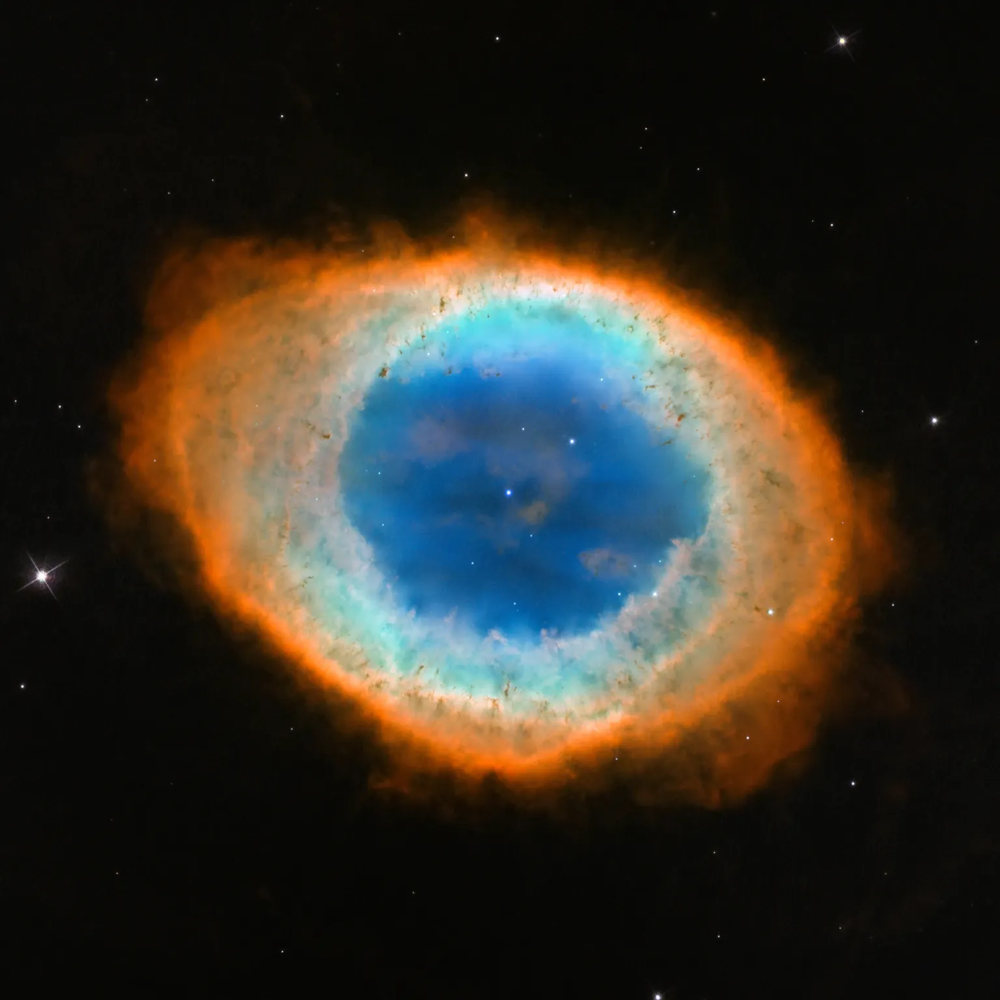

- *NGC 7293* Nebulosa de la **Hélice** (a la derecha de la rodilla de *Acuario*).

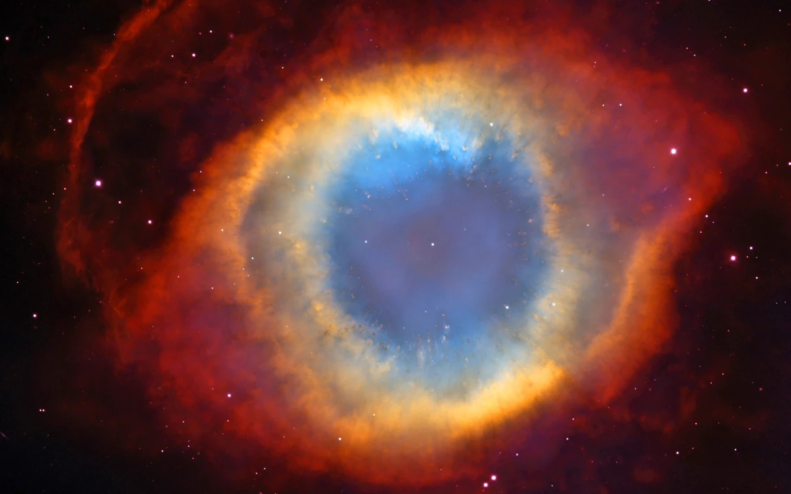

### Supernova
Restos de una **supernova**: estrella masiva al final de su vida antes de convertirse en un púlsar o un agujero negro.
- *M1* Nebulosa del **Cangrejo** astrónomos Chinos documentaron su explosión en el año 1054 (en el primer cuerno de *Tauro*).

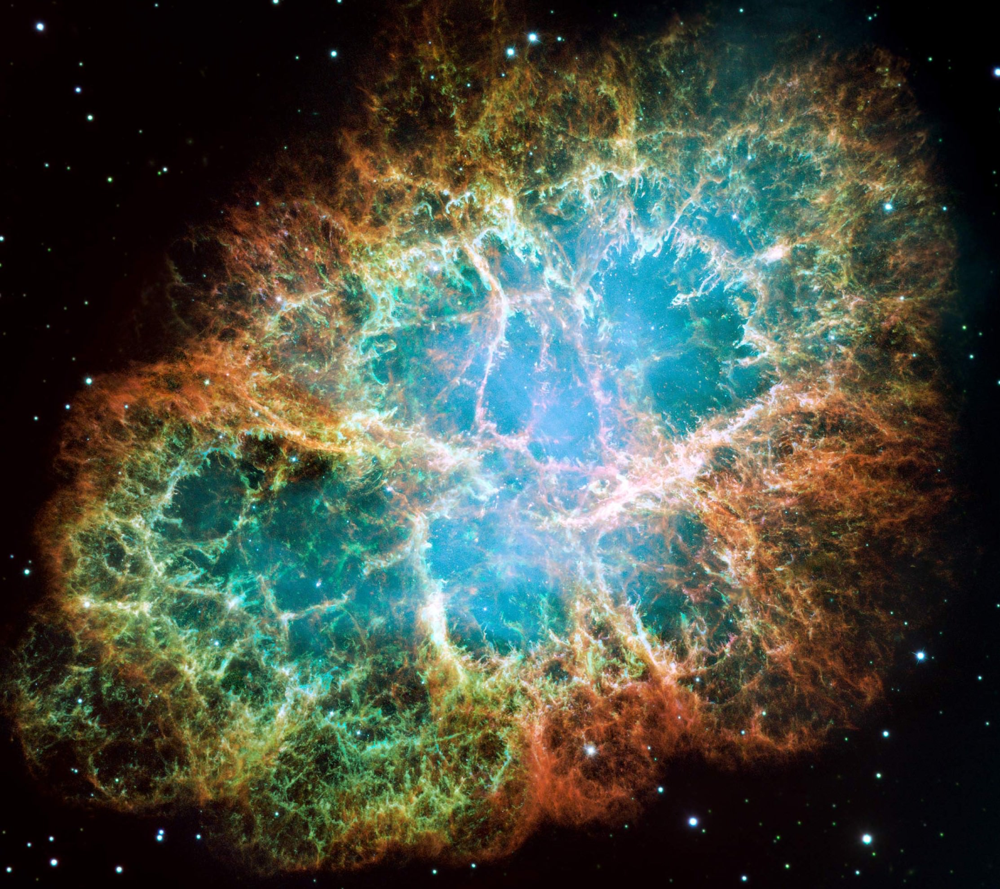

## 🔭 Observación
- **Parámetros**: Apertura, distancia focal, magnificación
- **Filtros**: color, contaminación, Ha, Oiii, Sii
- **Luz**: Niveles de magnitud y escala Brotle

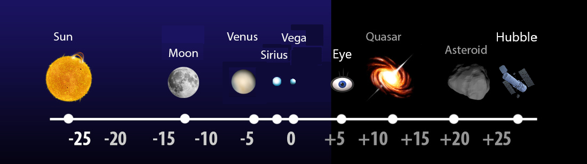

- **Telescopios**: refractor, reflector (Newtoniano), Cassegrain
- **Monturas**: altazimutal (trípode, dobsoniana), equatorial, motorizada (GoTo, Tracker)
- **Calibración**: Lights (información), Darks (ruido), Flats (polvo y viñeta)
- **Edición**: Stacking, histograma, curvas de color

## Misiones
- **URSS**: Laika, Sputnik, Gagarin, Venera
- **NASA**: Apollo, Pioneer, Voyager
- **Internacional**: ISS
- **Marte**: Curiosity, Oportunity, Perseverance, Ingenuity
- **Saturno**: Cassini-Huygens
- **SpaceX**: StarLink, cohetes reutilizables
- **Telescopios**: Hubble, Keppler James Webb