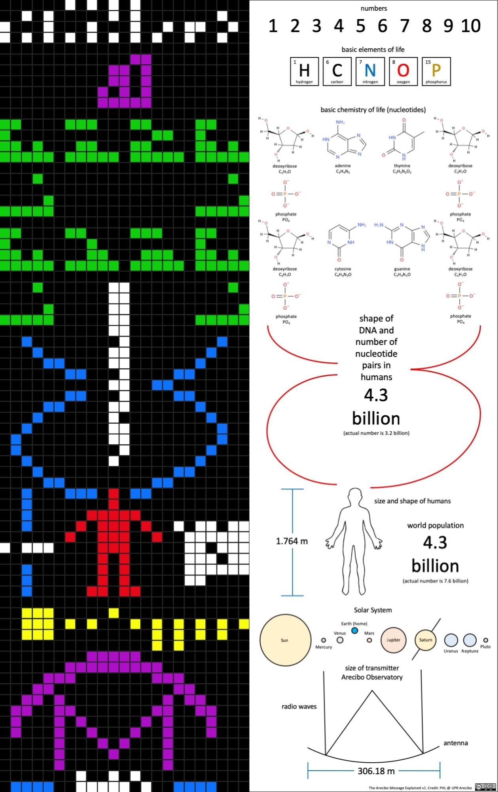
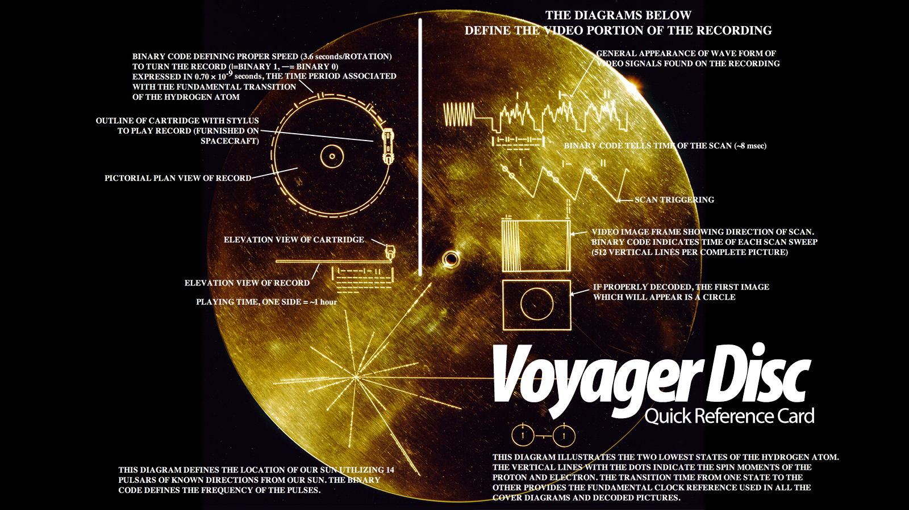

# Sistema solar

## ☀️ Sol
- Se mueve por la una línea que representa el plano del Sistema Solar llamado **eclíptica**.
- Debido a la **inclinación del eje** de la rotación de la tierra cambia la posición de la eclíptica dando lugar a las **estaciones**.
- Los puntos de inflexión son el día más largo, la noche más larga (**solsticios**) y las noches iguales (**equinocios**).
- El cambio en la posición del *Sol* por el eje de rotación la excentricidad de la órbita se ve en la **ecuación del tiempo** y en el **analema**.
- Tiene el **99%** de la **masa** del Sistema Solar.

## 🌕 Luna
- Luna > Fases > Salida y puesta de luna.
- La tierra es **4 x luna** está a **30 x tierras** de distancia y pesa **80 x lunas**.

- **No** tiene **atmósfera** ni placas **tectónicas** porque su centro no está suficientemente caliente para fundir y mover la roca de la corteza.
- Los **mares** son lava solidificada desde su formación y las **cráteres** impactos de meteoritos.

- En un **eclipse** lunar la tierra bloquea toda la *luz* menos la *roja* que se difumina con la atmósfera y llega a la luna.
- No hay eclipses *cada mes* por la *inclinación* de la órbita de la luna y no hay eclipses *cada año* por la *precesión* de esta órbita.
## 🛰️ Satélites
- Hay millones de satélites y restos de misiones espaciales en órbita:

- Órbitas > Geoestacionaria (alta) (meteo y comms) (36000km) > Polar (media) (navegación) > LEO (baja) (comms y observación terrestre) > Lagrange
- ISS (Estación Espacial Internacional) LEO, 2h, 2000km, 8km/s

- StarLink (en línea al lanzamiento)

## 🪐 Planetas
Se mueven cerca de la *eclíptica*. Rotan y orbitan el Sol en sentido antihorario respecto al polo norte.
### Mercurio
- (*1 Tierra = 2 x Mercurios*)
- Su día dura más que su año.
- Se pueden ver dos amaneceres en el mismo día por el movimiento retrógrado del Sol.
### Venus
- Tamaño similar a la *Tierra*.
- Sólo se ve al amanecer o al atardecer de ahí los nombres: **Lucero matutino / vespertino**.
- Podemos ver sus **fases**, como la Luna.
- Su atmósfera provoca un efecto invernadero infernal y **llueve ácido sulfúrico**.
- Su día (**250 días terrestres**) dura más que su año y rota al revés que el resto de planetas.

### La Tierra
- Tiene la **luna** más **grande** del *Sistema Solar* proporcionalmente (1 Tierra = 4 x Lunas)
### Marte
- (*1 Tierra = 2 x Martes*)
- Tiene la **montaña** más **alta** del *Sistema Solar* 2.5 veces más alta que el *Everest*.
- Tiene el **cañón** más **largo**, ancho y **profundo** del *Sistema Solar* 10 veces el Cañón del Colorado (ocuparía todo EEUU).
- Las zonas **bajas** tiene zonas **altas** en sus **antípodas** (Hellas / Alba), (Tharsis / Utopia), (Argyre / Elysium).

### Júpiter
- (*1 Júpiter = 11 x Tierras*)
- Gira muy rápido provocando muchos huracanes.
- **67 lunas** en total, las 4 lunas galileanas se pueden ver con prismáticos, tienen nombres de las amantes de *Zeus* y tienen las orbitas sincrozadas a razón de 1:2:4:10.
- **Io** es el objeto más **volcánico** del *Sistema Solar*.
- **Ganímedes** es la luna más **grande** del *Sistema Solar* (más grande que *Mercurio*) y genera un **campo magnético**.
- **Calisto** es el objeto con más **cráteres** del *Sistema Solar*.
- **Europa**, **Ganímedes** y **Calisto** tienen **océanos** subterráneos de **agua**.

### Saturno
- (*1 Saturno = 9 x Tierras*)
- Poco denso, **flotaría** en el agua.
- Su **anillos** tienen sólo **100 metros** de grosor y se forman porque diferencia de fuerza de gravedad del planeta es más fuerte que la gravedad de la luna.

### Urano
- (*1 Urano = 4 x Tierras*)
- Su descubridor lo llamó **Jorge**.
- Su **eje** de rotación con casi **90º** respecto a su órbita.
- Tiene océanos y lluvia de **diamantes**.
### Neptuno
- (*1 Neptuno = 4 x Tierras*)
- Se **predijo** su existencia antes de ser observado.
- Tiene el **viento** más rápido del *Sistema Solar*.
- Su luna más grande gira al revés, tiene un órbita muy inclinada, criovolcanes activos y es más grande que *Plutón*.
### Planeta 9
- *Plutón* fue un planeta, pero era es un **planeta enano** pequeño (*1 Tierra = 5 x Plutones*), con muchos asteroides cerca y con una órbita fuera del plano del resto.
- *Vulcano* es un **planeta inventado** para explicar la precesión de la órbita de *Mercurio* antes de conocer la *relatividad general*.
- Puede que exista otro **planeta no observado** con una órbita muy grande, pero no se ha confirmado.

# Espacio profundo
- El **catálogo Messier** tiene los objetos más fáciles de observar en el hemisferio norte.
- A partir de 2 millones de años luz se empiezan a ver otras *galaxias*. Entre los brazos de *Virgo* hay un *cúmulo* de **galaxias** del que el *Grupo Local* de galaxias donde está la *vía láctea* es miembro.
- **Maratón Messier** para ver lo 110 objetos del catálogo en una sola noche. 

## 💫 Vía Láctea
- En el brazo de la **Vía Láctea** donde está el *Sistema Solar* hay muchos *cúmulos abiertos* y *nebulosas* a menos 10000 años luz, se llama **Orión** porque está cerca de esta constelación, alejado de **Escorpio** y **Sagitario** donde esta el centro.
- En *invierno* la cara de la tierra opuesta al Sol apunta hacia afuera del brazo, donde está **Orión**. En *verano* apunta al centro de la **Vía Láctea**, donde está **Escorpio**. En *otoño* y *primavera* apunta hacia fuera, permitiendo ver otras *galaxias*, en primavera hay más porque en esa dirección están las más cercanas del **Cúmulo Local**.
- Los *cúmulos globulares* orbitan la **Vía Láctea** a partir de 6000 años luz.

- En el centro de la **Vía Láctea** hay un agujero negro supermaviso llamado *Sagitario A**.

## ✨ Constelaciones
- 88 en total, 48 clásicas de *Ptolomeo*, 12 del *Zodiaco*.
- Las 12 del *Zodiaco* cerca de la *eclíptica*.
- La designación de *Bayer* asigna una letra griega por orden de luminosidad a cada estrella de la constelación.
- La designación de *Flamsteed* asigna un número por orden de ascensión recta a cada estrella de la constelación del hemisferio norte. La designación *Gould* es lo mismo para el hemisferio sur.
- Las cercanas al zenit (norte / sur celeste) están visibles todo el año.
- Las cercanas al horizonte se ven en los dos hemisferios.
- Osa Mayor > Estrella Polar > Osa menor > Casiopea > Hora sideral
- Las constelaciones del hemisferio sur se nombraron en la era moderna: *octante*, *sextante*, *brújula*, *reloj*, *telescopio*, *microscopio*, *máquina neumática*, *barco*, *velas*, *quilla*...

## ⭐ Estrellas
- La mayoría de las estrellas más luminosas son **binarias** y están en la **Vía Láctea**.
- Las estrellas **grandes** son **azules**, se consumen **rápido** y mueren en **supernovas**.
- Las **pequeñas** son **rojas**, viven mucho terminan siendo **enanas marrones**.
- **Sirio** es la más luminosa, nariz de *Canis Maior*, le apunta el cinturón de *Orión*.
- **Alfa Centauri** es el sistema solar más cercano a 4 años luz.
- **Betelgeuse** en el cinturón de *Orión*, es **764** veces más **grande** que el Sol.
- **Vega** fue la estrella polar al inicio de la civilización (12000 a.C.) con magnitud 0 y parte del *triángulo estival* con **Altair** y **Deneb** (que reposan en vía *Vía Láctea*).
- *M45* Las **Pléyades** con estrellas jóvenes con el polvo aún a su alrededor (cúmulo *abierto* 7 estrellas en el culo de *Tauro*).
- **M13** Cúmulo *globular* (en el sobaco de *Hércules*).
- **M3** Cúmulo *globular* (a la derecha de *Bootes*).

## 🌌 Galaxias
- *M31* **Andrómeda** (apunta una punta de *Casiopea*) tiene galaxias satélites. Nos chocamos y fusionamos con ella dentro de 6000 millones de años.
- *M51* **Remolino** (justo debajo del asa del cazo de la *Osa Mayor*).
- *M33* **Triángulo** (entre el *Triángulo* y *Andrómeda*).
- *M87* Chorro de plasma parte de un cúmulo de galaxias donde se hizo la primera foto de un agujero negro (en la mano de *Virgo*).

- *NGC 5139* Cúmulo *Omega Centauri* (en el lomo del *Centaruro*).
- *M104* **Sombrero** (entre *Virgo* y *Corvus*).

### Conjuntos de galaxias
- **Virgo**
- **Hércules**

## ☁️ Nebulosas
Son el nacimiento (nebulosas de *emisión* o *absorción*) o la muerte de estrellas (nebulosas *planetarias* o *supenovas*).
### Formación estelar
- *M42* Nebulosa de **Orión** (debajo del cinturón) (es la única visible con el ojo desnudo).
- *M8* Nebulosa del **Lago** (encima del brazo de *Sagitario*).
- *M16* **Pilares de la Creación** o Nebulosa del *Águila*.

- Nebulosas del **Corazón** y el **Alma** (debajo de *Casiopea*).

### Planetarias
Son **gases** expulsados por la **enana blanca** apagándose en el centro.
- *M27* Nebulosa **Dumbbell** (entre *Vulpecula* y *Sagitta*, en medio del triángulo de verano).
- *M57* Nebulosa del **Anillo** (en la sujección de las cuerdas de *Lira*).

- *NGC 7293* Nebulosa de la **Hélice** (a la derecha de la rodilla de *Acuario*).

### Supernova
Restos de una **supernova**: estrella masiva al final de su vida antes de convertirse en un púlsar o un agujero negro.
- *M1* Nebulosa del **Cangrejo** astrónomos Chinos documentaron su explosión en el año 1054 (en el primer cuerno de *Tauro*).

## Complejos moleculares
- **Orión**: Complejo de nebulosas de absorción como el *caballo*, la *bruja* o la supernova *bucle de Barnard*.
- **Rho Ophiuci**: También en la constelación de *Escorpio*
- **Tauro**
- **Perseo**: También en la constelación de *Auriga*
- **Cisne**
- Fisura de **Aquila**: en *Serpens* y *Aquila*

# 🔭 Observación
- **Parámetros**: Apertura, distancia focal, magnificación
- **Filtros**: color, contaminación, *Ha*, *Oiii*, *Sii*
- **Luz**: Niveles de magnitud y escala Brotle

- **Distancias**: Unidad Astronómica, Parsec, año luz, paralaje, candelas estándar
- **Telescopios**: refractor, reflector (*Newtoniano*, *Dobsoniano*), catadióptrico (*Schmidt-Cassegrain*)
- **Monturas**: altazimutal (trípode, dobsoniana), equatorial, motorizada (*GoTo*, *Tracker*)
- **Calibración**: *Lights* (información), *Darks* (ruido térmico), *Flats* (polvo y viñeta) y *Bias* (ruido de cámara)
- **Edición**: *Stacking* (combinación para detectar y eliminar ruido), histograma (recuperar información orcura), curvas de color (contraste no lineal), balance de blancos (color falso)
- **Very Large Telescope**: Refleja láseres en la atmósfera para medir la oscilación y la cancela deformando el espejo del telescopio.
- **Event Horizon Telescope**: Red de radiotelescopios esparcidos por el mundo que hicieron las fotos de los agujeros negros en *M87* y *Sgr A**.

## Misiones
- **URSS**: *Laika*, *Sputnik*, *Gagarin*, *Venera*, *Soyuz* (la nave más utilizada)
- **NASA**: *Apollo*, *Pioneer*, *Voyager*
- **Internacional**: *ISS*
- **Marte**: *Curiosity*, *Oportunity*, *Perseverance*, *Ingenuity*
- **Saturno**: *Cassini-Huygens*

- **SpaceX**: *StarLink*, *Falcon 9* (cohetes reutilizables)
- **Telescopios**: *Hubble*, *Keppler James Webb*

## Mensajes
- **Arecibo**: Se envía en *1974* hacia *M13* y en 2001 aparace una respuesta en un campo de maíz.

- **Pioneer** y **Voyager**: *Pioneer 10*, *Pioneer 11*, *Voyager 1* y *Voyager 2* son 4 sondas lanzadas en los *70* y *New Horizons* en *2006* con **placas** y un **disco** de oro con imagenes, sonidos, saludos y música.

- **Legos**
- **Europa Clipper**: Sonda enviada en *2024* para estudiar el océano subterráneo de una luna de *Júpiter*. Se adjunta una placa con un **poema** y un **microchip** con nombres escritos con letras de 75 nanómetros.
- **Lincos**: *Lingua cosmica* usando un diccionario con ejemplos, empezando por conceptos (*> < = + -*), números unarios (*. .. ...*), matemáticas, lógica, conjuntos, palabras, conversación y física.
- **CosmicOS**: Sistema operativo inspirado por *Lincos* que usa sólo 4 símbolos.
